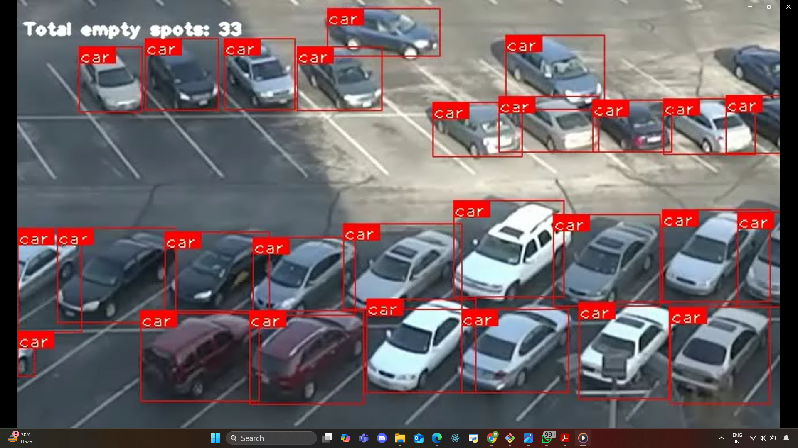

# Smart-Parking-System

🔍 Real-Time Detection of Occupied and Empty Parking Slots using YOLO
This project is a real-time AI-powered solution designed to monitor vehicle presence in a parking lot and track the availability of parking spaces using video input. Leveraging the YOLO (You Only Look Once) deep learning object detection algorithm, the system identifies cars in each frame and matches them against predefined parking zones to calculate the number of occupied and empty spots.

The goal is to demonstrate how computer vision can assist in automating smart city infrastructure—particularly in optimizing parking space utilization and surveillance.

# 🎯 Project Objective
1. Analyze a parking lot video feed in real-time

2. Detect vehicles using YOLO-based object detection

3. Determine whether each marked parking slot is occupied or vacant

4. Maintain a real-time count of available parking spots

5. Build a customizable, open-source solution that works with various camera angles and video qualities

# 🧠 How It Works
1. Initial Setup: A reference image from the parking lot is used to manually define the coordinates of each parking spot.

2. Detection: Each video frame is passed through the YOLO model to detect cars.

3. Matching: If a detected car overlaps a defined parking zone, that spot is marked "occupied"; otherwise, it's "empty".

4. Visualization: The system draws boxes around each spot and updates the real-time count of empty spaces.

5. The result is a live video feed with overlaid visual indicators showing which spots are free and how many are available.

# 📉 Challenges & Real-World Limitations
Despite using powerful AI models, real-world constraints affect accuracy:

Camera Position: An angled or low-mounted camera makes it hard to distinguish cars.

Low-Resolution Videos: Reduced image clarity affects detection.

Occlusions: People walking by or reflections (like from mirrors or windows) can hide parked cars.

Model Limitations: YOLO, while fast, may sometimes miss cars or detect false positives, especially under complex lighting or perspective.

# 🎥 Demo Highlights
The model successfully tracks occupied and empty spots live from a parking video.

Count updates dynamically based on vehicle detection.

Can be adapted for live CCTV camera feeds or higher-quality parking lot footage.

# 🔧 Future Improvements
Integrate Mask R-CNN or YOLOv8 for better detection under occlusions

Implement a parking alert system

Store data to the cloud for analytics and visualization dashboards

Build a mobile/web dashboard showing available slots in real-time
